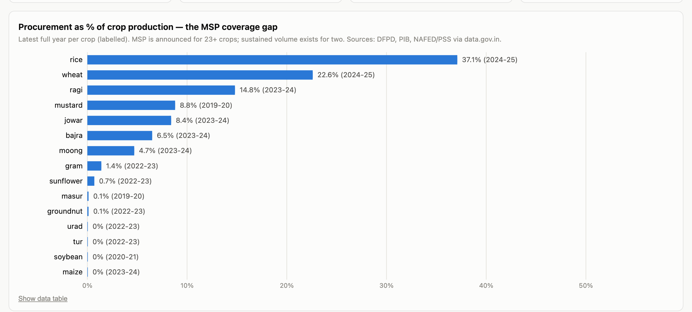
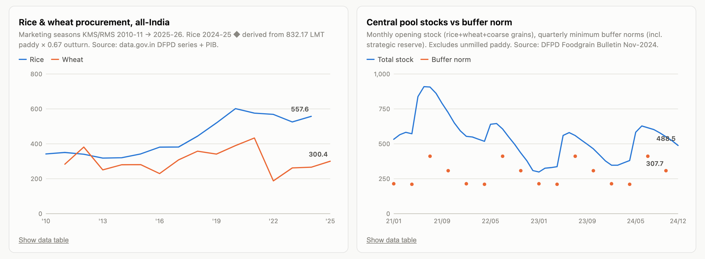
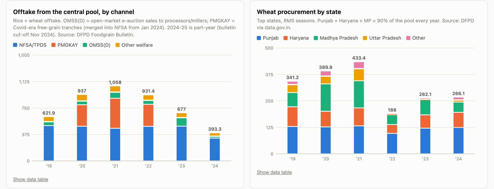
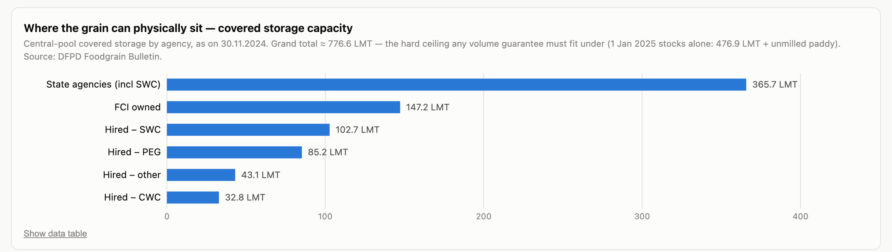

# FCI Warehouse · MSP vs MSV

Research + data project evaluating India's foodgrain procurement system and whether a
**Minimum Support Volume (MSV)** guarantee — government committing to buy a minimum *quantity*
of each crop — could extend effective price support beyond rice and wheat, where the
**Minimum Support Price (MSP)** currently works in practice.

## Scope

1. **FCI procurement trends** (10–15 yrs) — rice/wheat volumes, state-wise concentration
   (Punjab/Haryana → MP/Telangana shifts), central pool stocks vs buffer norms, economic
   cost vs MSP, food subsidy burden.
2. **Why MSP ≈ rice + wheat only** — procurement infrastructure, PDS offtake linkage,
   Shanta Kumar committee farmer-coverage estimates.
3. **Existing extensions** — PM-AASHA (PSS / PDPS / PPSS), NAFED pulses & oilseeds,
   CCI cotton, and their outcomes.
4. **The MSV case** — volume-based guarantee design, fiscal cost debate (legal-MSP
   estimates), storage/disposal constraints, WTO AMS limits, US CCC / EU intervention
   analogues.
5. **Haryana case study** — food processing policy, backward linkages (Mera Pani Meri
   Virasat, Bhavantar Bharpai, 14-crops-at-MSP claim) and forward linkages
   (government-as-seller: HAFED processing units, FCI OMSS(D) sales to millers).
6. **Ethanol precedent** — FCI rice & NAFED/NCCF maize supplied to distilleries for the
   ethanol blending programme: evidence that policy can create industrial offtake for
   state-procured grain, and the conditions it requires.

## Dashboard highlights

**The one-picture argument** — MSP is announced for 23+ crops, sustained procurement volume exists for two:

**Procurement trend & stocks vs buffer norms** — record buying, stocks pulling away from need:

**Where the grain goes & who supplies it** — offtake by channel (incl. OMSS sales to processors) and Punjab-heavy wheat concentration:

**The physical ceiling** — covered storage capacity, the hard constraint on any volume guarantee:

Full dashboard: [`dashboard/index.html`](dashboard/index.html) (self-contained — clone and open, or serve locally; `?theme=dark` forces dark mode). Full-page views: [light](dashboard/screenshots/full_light.png) · [dark](dashboard/screenshots/full_dark.png). Reproduce the charts in Colab via the badge above.

## Reference

- [GLOSSARY.md](GLOSSARY.md) — every abbreviation used across the reports, expanded and categorised.

## Layout

| Path | Contents |
|---|---|
| `report/` | Cited research report (MSP vs MSV evaluation + Haryana case study) |
| `data/` | CSVs from DFPD Foodgrain Bulletin, FCI storage/capacity data, UPAg — with `MANIFEST.md` recording source URLs and gaps |
| `dashboard/` | Interactive HTML dashboard: procurement vs storage vs disposal (PDS / PMGKAY / OMSS / ethanol / exports) |

## Data sources

Official only: DFPD Monthly Foodgrain Bulletin, fci.gov.in, upag.gov.in, PIB, CACP,
Economic Survey — plus credible analyses (ICRIER, NITI Aayog, academic papers).
No fabricated or interpolated figures; every file's provenance is in `data/MANIFEST.md`.

## Status

- [x] Repo scaffold
- [x] Research report → `report/msp-vs-msv-main-report.md`
- [x] Haryana + ethanol brief → `report/haryana-food-processing-linkages.md`
- [x] Data collection → `data/` (6 CSVs + MANIFEST)
- [x] Dashboard → `dashboard/index.html` (self-contained, light/dark, table views)

## Published essay

**The Price of Grain** — the administered price ladder, farmer coverage, trade parity, and the MSP+MSV ratio framework: [report/pricing-msp-msv-published.html](report/pricing-msp-msv-published.html) (also live as a Claude artifact).
